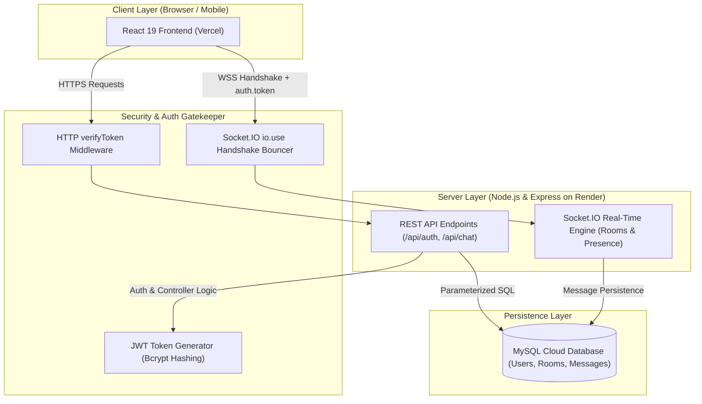

<div align="center">

# 💬 Chatify — Real-Time Scalable Workspace & Chat Application

[](https://chatify-app-zeta-six.vercel.app)
[](https://chatifyapp-yy6k.onrender.com)
[](LICENSE)

A production-grade, full-stack real-time collaboration and chat application built with **Node.js, Express, Socket.IO, React 19, Tailwind CSS v4, and MySQL**. Features end-to-end JWT authentication on both HTTP and WebSocket layers, persistent room-based multiplexing, live user presence, typing indicators, and a responsive glassmorphic UI.

[**Explore Live Application 🚀**](https://chatify-app-zeta-six.vercel.app/login) · [**Report Bug 🪲**](https://github.com/KrishDevCrafting/ChatifyApp/issues) · [**Request Feature 💡**](https://github.com/KrishDevCrafting/ChatifyApp/issues)

</div>

---

## 🌟 Key Highlights

- **⚡ Low-Latency Real-Time Engine**: Built on bidirectional **Socket.IO** connections for instant message transmission, typing broadcasts, and online presence tracking.
- **🔐 Dual-Layer JWT Security**:
  - **REST API Layer**: Stateless HTTP route protection with custom `verifyToken` middleware.
  - **WebSocket Handshake Layer**: Strict connection-time authentication (`io.use`) verifying JWT before any socket event is registered. Prevents spoofing and unauthorized connections.
- **🏠 Channel Multiplexing**: Create and switch between persistent discussion rooms (`#general`, `#tech`, etc.) with message history loaded from relational storage.
- **📱 100% Mobile Responsive**: Dedicated slide-out drawer navigation, backdrop blur overlay, and adaptive message layouts tailored for mobile, tablet, and desktop viewports.
- **🎨 Modern Glassmorphism UI**: High-end dark & light mode support, smooth gradients, ambient floating orbs, and interactive 3D perspective card tilts.
- **🗄️ Relational Data Integrity**: Backed by **MySQL** with foreign key constraints, `ON DELETE CASCADE`, indexed queries, and full protection against SQL injection using parameterized statements.

---

## 🛠️ Tech Stack & Architecture

### **Frontend**
- **Library/Framework**: React 19, Vite 8
- **Styling**: Tailwind CSS v4 + Custom Vanilla Glassmorphic CSS
- **Routing**: React Router v7
- **Real-Time Client**: `socket.io-client`
- **Hosting**: Vercel Edge Network

### **Backend**
- **Runtime**: Node.js (ES Modules)
- **Web Framework**: Express.js (MVC Pattern)
- **WebSockets**: Socket.IO
- **Database Driver**: `mysql2/promise` (Connection Pooling)
- **Security**: `jsonwebtoken` (JWT), `bcryptjs` (Salt Rounds = 10), CORS
- **Hosting**: Render (Cloud Web Service)

---

## 🏗️ System Architecture



---

## 📡 REST API & WebSocket Specifications

### **Authentication (`/api/auth`)**
| Method | Endpoint | Access | Description |
| :--- | :--- | :--- | :--- |
| `POST` | `/api/auth/signup` | Public | Register new user with salted bcrypt hashing |
| `POST` | `/api/auth/login` | Public | Authenticate user & return signed 7-day JWT token |
| `GET` | `/api/auth/me` | 🔐 Private | Validate token & fetch authenticated profile |

### **Chat & Rooms (`/api/chat`)**
| Method | Endpoint | Access | Description |
| :--- | :--- | :--- | :--- |
| `GET` | `/api/chat/rooms` | 🔐 Private | Fetch all available discussion channels |
| `POST` | `/api/chat/rooms` | 🔐 Private | Create a new discussion channel (Unique constraint) |
| `GET` | `/api/chat/messages/:roomId` | 🔐 Private | Load historical messages for a specific room |
| `POST` | `/api/chat/messages` | 🔐 Private | Send and persist a new message via REST |

### **Real-Time WebSocket Events (`Socket.IO`)**
| Event Name | Direction | Payload | Description |
| :--- | :--- | :--- | :--- |
| `join room` | Client ➔ Server | `{ room, roomId }` | Subscribes socket to room & updates online presence |
| `chat message` | Bi-directional | `{ room, roomId, text }` | Broadcasts message to room & writes to MySQL |
| `typing` | Client ➔ Server | `roomName` | Broadcasts typing indicator to other room members |
| `stop typing` | Client ➔ Server | `roomName` | Clears typing indicator |
| `room users` | Server ➔ Client | `[username1, username2]` | Synchronizes unique online users in current room |

---

## 🗄️ Database Schema

```sql
-- 1. Users Table
CREATE TABLE users (
  id INT AUTO_INCREMENT PRIMARY KEY,
  username VARCHAR(100) NOT NULL UNIQUE,
  email VARCHAR(150) NOT NULL UNIQUE,
  password VARCHAR(255) NOT NULL,
  created_at TIMESTAMP DEFAULT CURRENT_TIMESTAMP
);

-- 2. Chat Rooms Table
CREATE TABLE rooms (
  id INT AUTO_INCREMENT PRIMARY KEY,
  name VARCHAR(100) NOT NULL UNIQUE,
  created_by INT NOT NULL,
  created_at TIMESTAMP DEFAULT CURRENT_TIMESTAMP,
  FOREIGN KEY (created_by) REFERENCES users(id) ON DELETE CASCADE
);

-- 3. Messages Table
CREATE TABLE messages (
  id INT AUTO_INCREMENT PRIMARY KEY,
  room_id INT NOT NULL,
  user_id INT NOT NULL,
  content TEXT NOT NULL,
  created_at TIMESTAMP DEFAULT CURRENT_TIMESTAMP,
  FOREIGN KEY (room_id) REFERENCES rooms(id) ON DELETE CASCADE,
  FOREIGN KEY (user_id) REFERENCES users(id) ON DELETE CASCADE
);
```

---

## 🚀 Local Development Setup

### **Prerequisites**
- **Node.js** v18+ installed
- **MySQL** server running locally

### **1. Clone the Repository**
```bash
git clone https://github.com/KrishDevCrafting/ChatifyApp.git
cd ChatifyApp
```

### **2. Backend Setup**
```bash
cd backend
npm install
```

Create a `.env` file in `/backend`:
```env
PORT=3000
DB_HOST=localhost
DB_USER=root
DB_PASSWORD=your_mysql_password
DB_NAME=chat_app
JWT_SECRET=your_super_secret_jwt_key
CLIENT_URL=http://localhost:5173
```

Start the backend development server:
```bash
npm run dev
```

### **3. Frontend Setup**
```bash
cd ../frontend
npm install
npm run dev
```

The application will run locally at `http://localhost:5173` connecting to `http://localhost:3000`.

---

## 🛡️ Security Best Practices Implemented

- **Salted Password Hashing**: Passwords are never stored in plain text. Hashed using `bcrypt` with 10 salt rounds ($2^{10}$ iterations).
- **Parameterized SQL Queries**: All database interactions use `?` placeholders with `mysql2/promise` to prevent SQL Injection attacks.
- **Fail-Fast Input Validation**: Requests with missing or invalid fields are rejected early before hitting database layers.
- **Tamper-Proof Identity**: User identification inside WebSocket events is read directly from `socket.user` (verified JWT payload), never accepted from client-supplied strings.
- **CORS Policies**: Strict cross-origin resource sharing allowing only verified origins in production.

---

## 👤 Author

**Krish**  
- **GitHub**: [@KrishDevCrafting](https://github.com/KrishDevCrafting)
- **Project**: Chatify Real-Time Workspace

---

## 📄 License

This project is licensed under the [MIT License](LICENSE).